<!-- _class: title cover -->
<!-- _header: "" -->
<!-- _footer: "" -->
<!-- _paginate: false -->

Weekly journal club  ·  You record  ·  The paper does the talking

# AI in Medicine Paper Club

**Episode 1** — When the LLM reaches the clinic

Jonas Wolber  ·  RWTH Aachen  ·  Digital General Practice

---

This week's paper

# A generative LLM in live primary care

**Agweyu et al.** · *Nature Medicine* · 26 June 2026

> GPT-4o inside 16 Kenyan clinics. ~10k patients. A hard endpoint.

 Open access **CC BY 4.0**

doi:10.1038/s41591-026-04503-6

---

Why this paper

# Exams are not clinic

<strong>Vignettes look easy</strong>
LLMs crush tests. Clinic is messier.

<strong>60% of amenable deaths</strong>
In LMICs, after people already reached care.

<strong>Clinical officers</strong>
3-year diploma. Often no senior next door.

<strong>0.3 physicians / 1,000</strong>
Sub-Saharan Africa vs OECD 3.9.

---

The intervention

# AI Consult 2.0 in the EMR

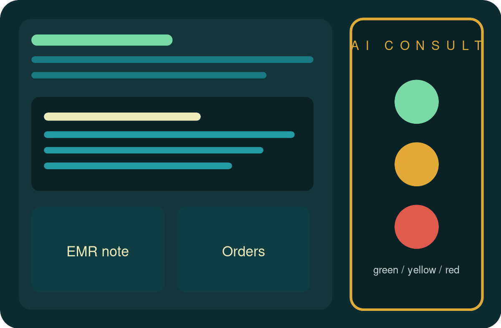

GPT-4o · May 2025 · **US$0.04** / patient · accept, edit, or ignore

---

Design

# Pragmatic cluster RCT

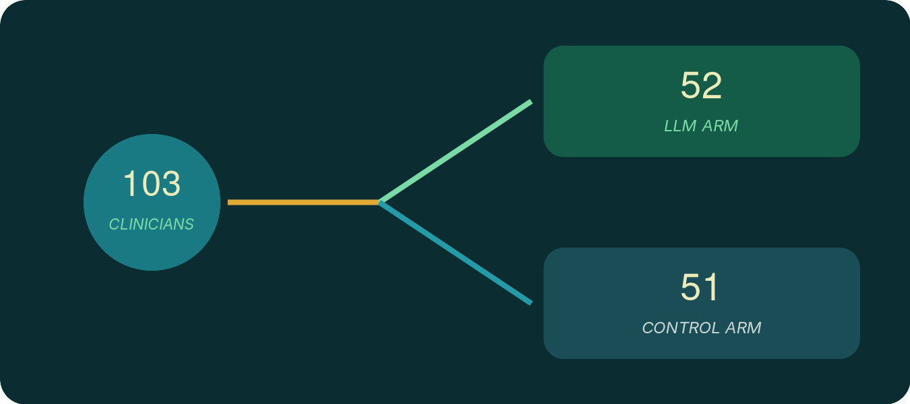

<strong>16 clinics</strong>
Nairobi &amp; Kiambu

<strong>9,347</strong>
encounters analysed

<strong>14 days</strong>
treatment-failure window

<strong>Apr–Jul 2025</strong>
powered for a 50% drop

---

<!-- _class: figure -->

## Fig. 1 — CONSORT: clusters, then patients

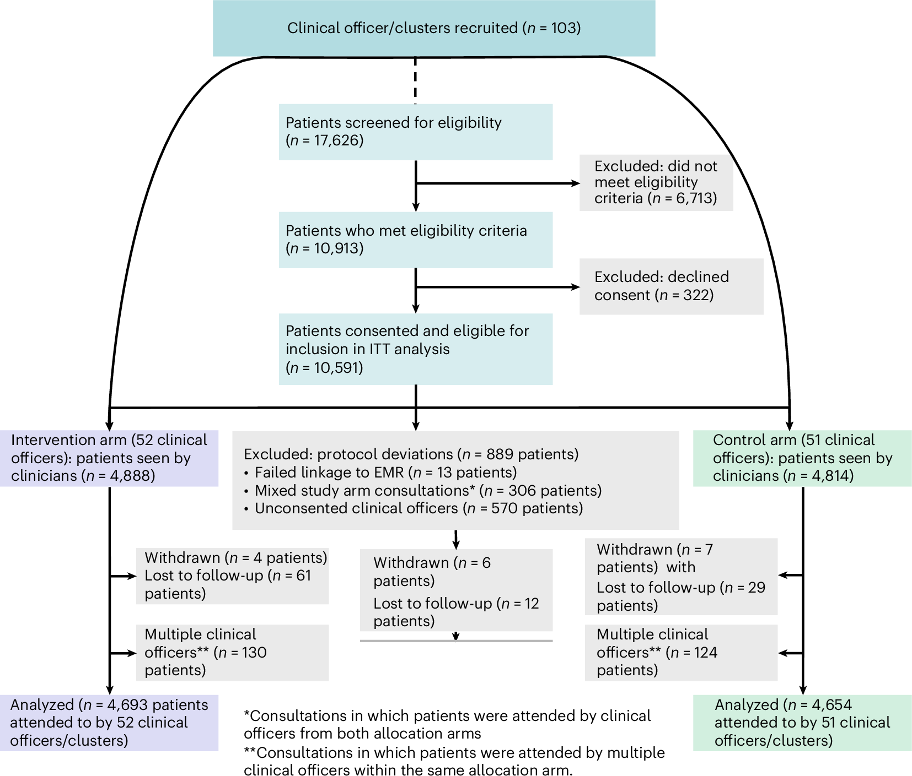

Screened 17,626 → analysed 4,693 vs 4,654. Adults 18–55, 56% women, ~60% febrile/infectious.

---

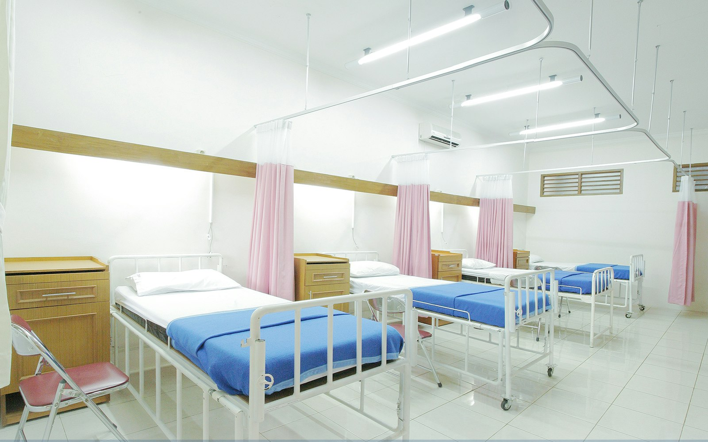

Primary outcome

# Treatment failure did not fall

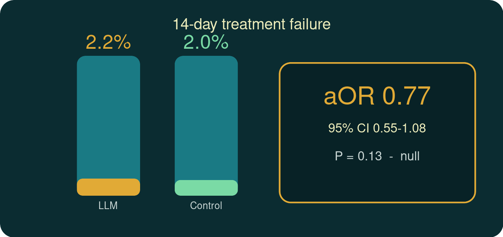

They can reject a revolution. They cannot confirm a nudge.

---

<!-- _class: figure -->

## Table 2 — ITT and per-protocol sit on the same number

Failure counts 94 vs 102. Odds ratio below 1; confidence interval crosses 1.

---

<!-- _class: figure -->

## Fig. 2a — Notes got better

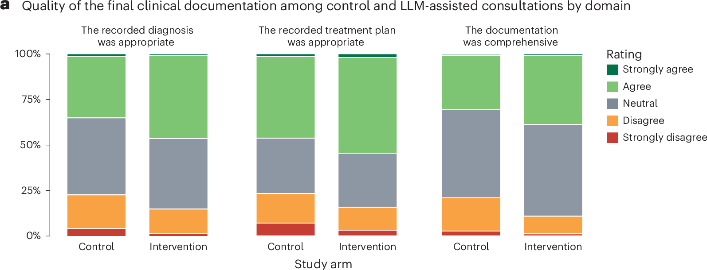

Appropriate diagnosis aOR 1.74 · comprehensive note 1.68 · appropriate plan 1.71 — all P &lt; 0.001.

---

<!-- _class: figure -->

## Fig. 2b — Linger here: a mostly-safe model, a messy team

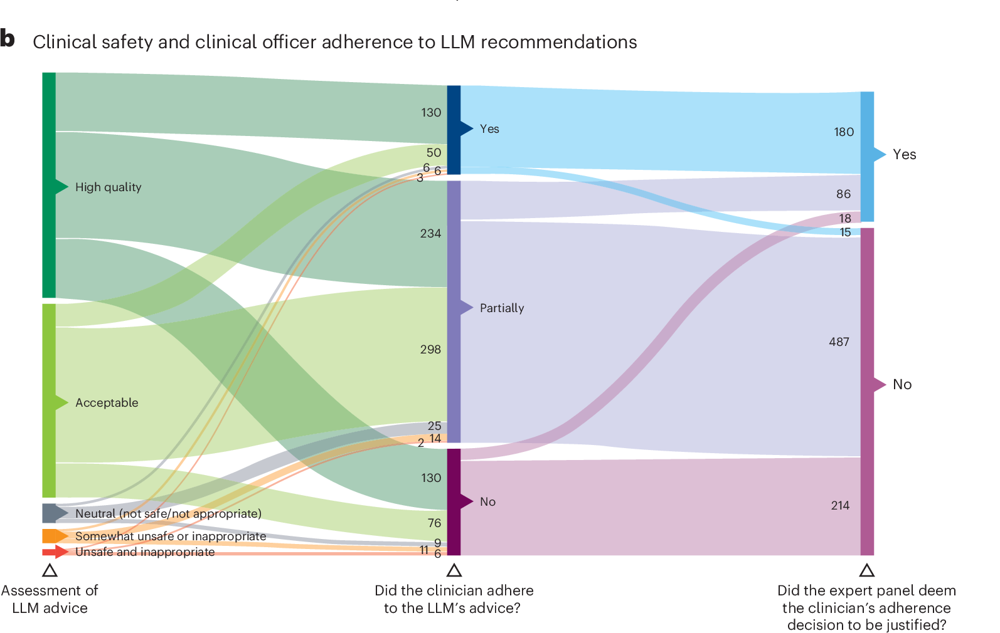

1,000 red alerts: 91.8% safe-ish · 1.1% unsafe. Followed fully 19.5%. Expert panel: follow-or-ignore <strong>not justified in 71.6%</strong>.

---

<!-- _class: figure -->

## Fig. 3 — Prescribing and sentinel conditions, mostly null

Antibiotics, antimalarials, HTN, malnutrition: no clear effect. Fewer “at risk of T2D” labels (aOR 0.88, P = 0.023).

---

<!-- _class: figure -->

## Extended Data Fig. 1 — No subgroup rescues the primary

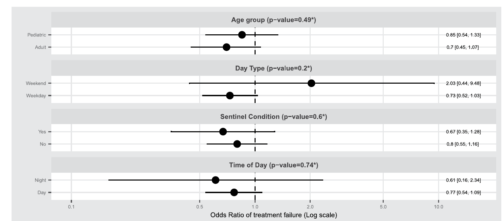

Age, weekend, sentinel condition, night vs day. Interactions are noisy.

---

<!-- _class: figure -->

## Extended Data Fig. 2 — Same direction, too few events

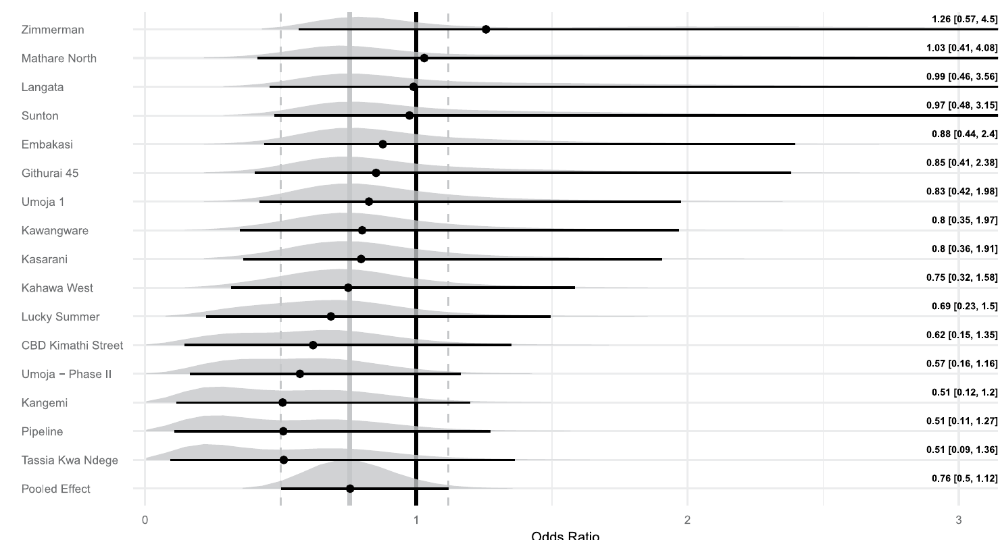

14 / 16 sites point toward benefit. Pooled OR 0.76 (95% CrI 0.50–1.12).

---

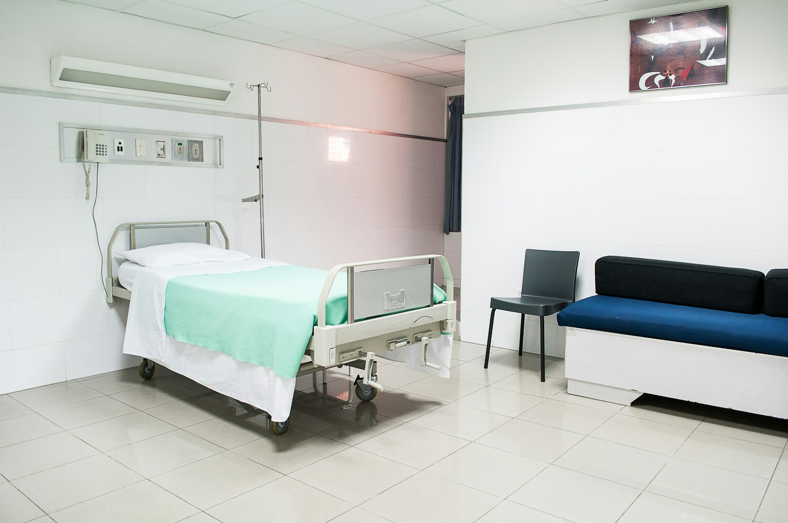

<!-- _class: figure -->

## Extended Data Fig. 3 — Patients did not notice

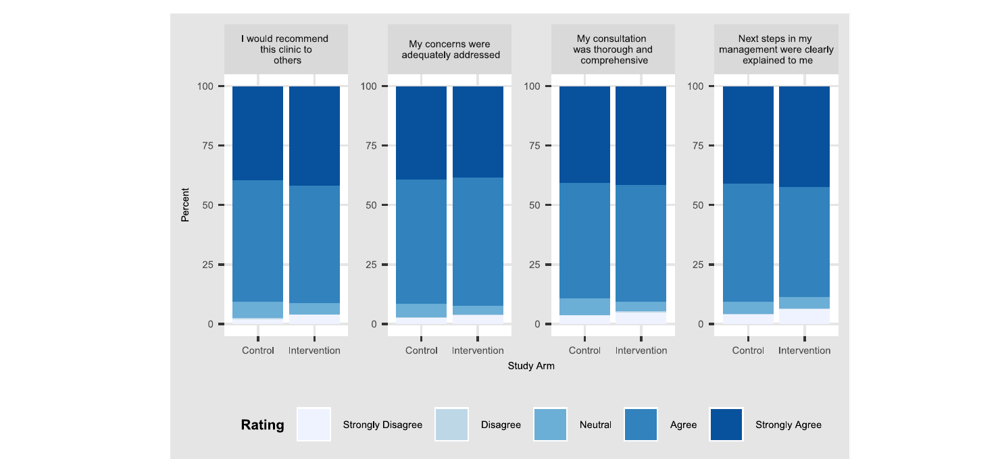

Median 4/5 both arms. Visit 11 min. 33 SAEs judged unrelated.

---

Interpretation

# Why the primary can be null

<strong>Powered for 50%</strong>
Observed effect, if any, is a nudge.

<strong>Multi-cause</strong>
Housing, follow-up, the next clinician.

<strong>Optional use</strong>
Effectiveness, not enforced efficacy.

<strong>High baseline</strong>
Penda already audits and digitizes.

<strong>14 days</strong>
Note quality might pay off later — or never.

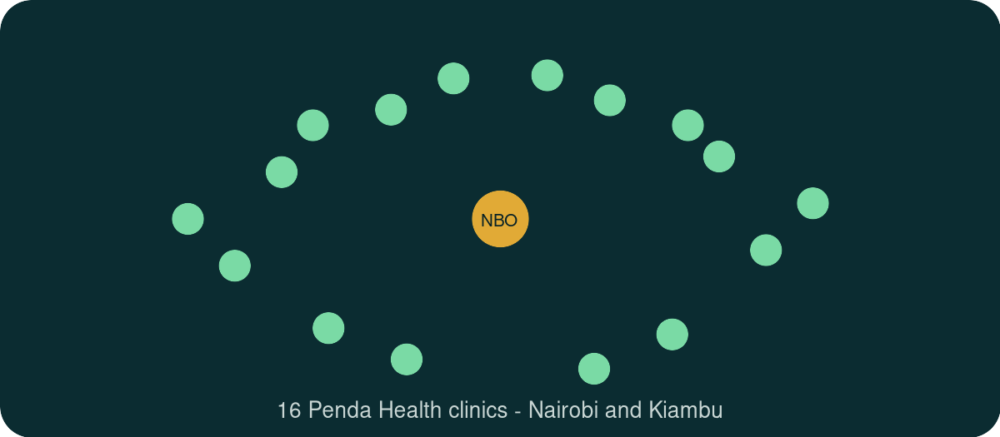

---

What I am taking into next week

# Process moved. Outcomes did not — yet

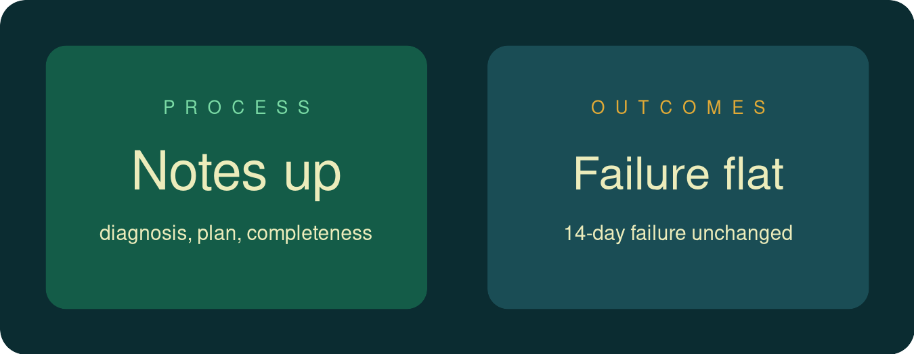

Override **rate** is easy. Override **quality** is Fig. 2b. Deskilling is unnamed in the data.

---

Your turn

# Paper club questions

<strong>1. Next endpoint?</strong>
Which primary, and can you actually power it?

<strong>2. Better notes</strong>
Success, stepping stone, or the wrong target?

<strong>3. Override</strong>
Healthy skepticism vs a tool too easy to ignore?

<strong>4. Where next?</strong>
Public-sector and rural replications before scale?

---

Take-home

# Three lines

<strong>Safe*</strong>
No related SAE signal at this scale.

<strong>Better notes</strong>
Diagnosis, plan, completeness.

<strong>Null primary</strong>
14-day failure unchanged.

<strong>Modest?</strong>
Large benefit unlikely.

\*Not a formal non-inferiority safety analysis.

---

<!-- _class: title cover -->
<!-- _header: "" -->
<!-- _paginate: false -->

Episode 1  ·  not medical advice  ·  a careful reading

# See you next week

**Paper** Agweyu et al., *Nat Med* 2026 · CC BY 4.0  
**Photos** Unsplash · **Icons** Lucide ISC  
**You** record and speak

Jonas Wolber  ·  AI in Medicine Paper Club
