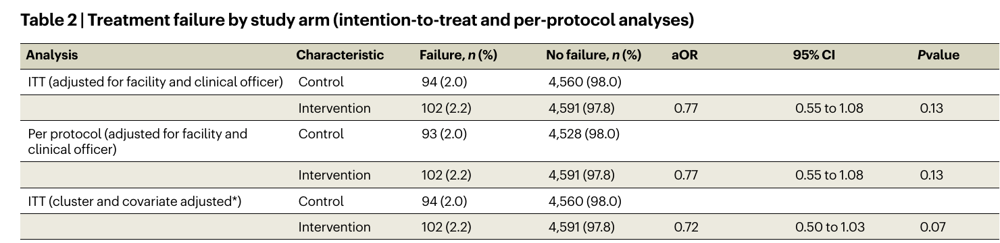
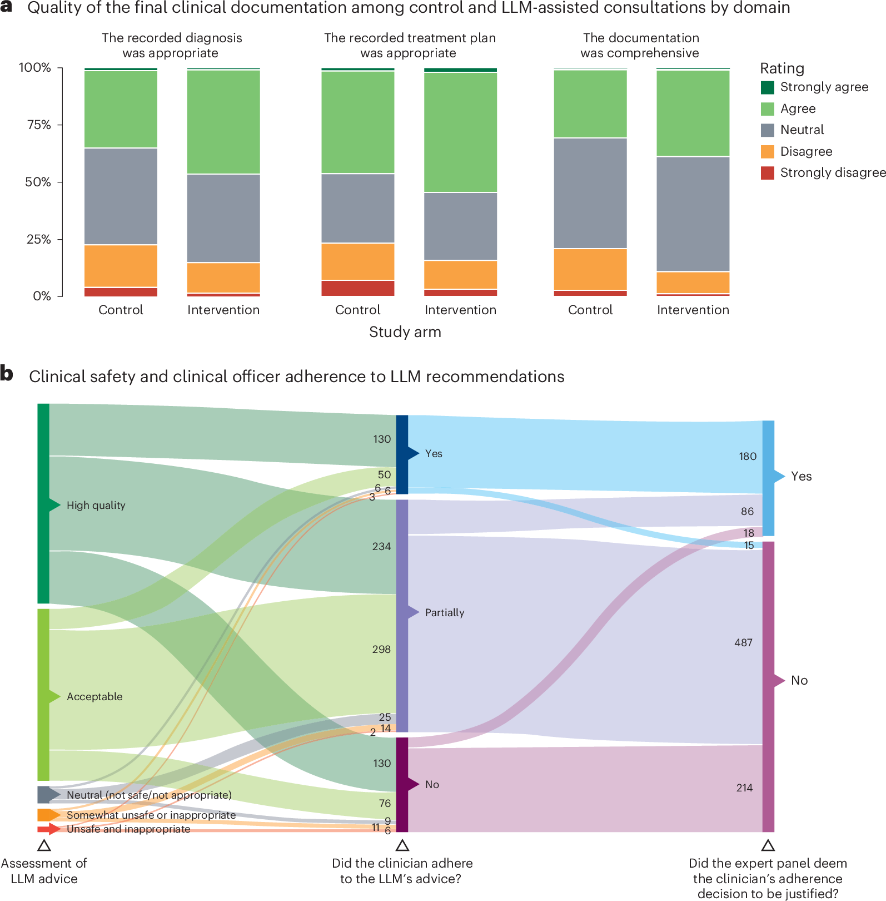
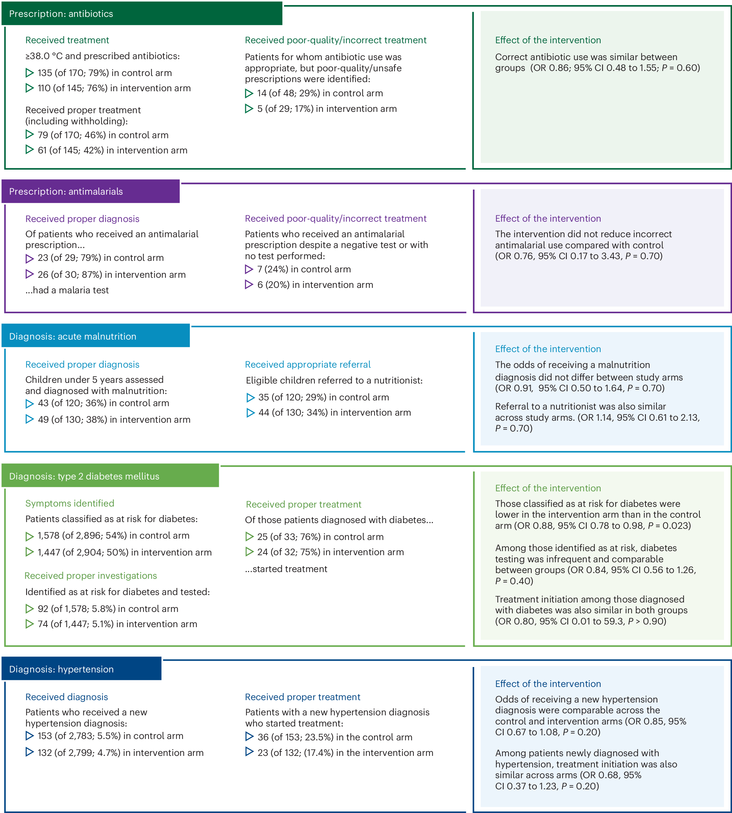

This is a draft for **AI in Medicine Paper Club**, a weekly series I want to run on YouTube: one new high-impact paper, a short script, a slideshow, then I talk through it. The markdown below is ready to publish here later. It is not live yet.

---

Large language models look brilliant on exams, vignettes, and leaderboards. That is not the same thing as helping a patient who walked into clinic this morning.

This week's paper is one of the first times we get to watch that gap close — and stay a little open. In June 2026, Ambrose Agweyu, Bilal Mateen, and colleagues published a pragmatic cluster-randomized trial in [*Nature Medicine*](https://doi.org/10.1038/s41591-026-04503-6): GPT-4o, sitting inside the electronic medical record of 16 primary care clinics in Nairobi and Kiambu, Kenya. Almost 10,000 patients. 103 clinical officers. A hard clinical endpoint.

The short version: the model was **safe**, notes got **better**, and **14-day treatment failure did not fall**.

That combination is more interesting than either a hype paper or a takedown.

## Why this paper, and why now

I work in digital general practice. A lot of medical AI still lives in retrospective AUCs and simulated cases. This trial did the unfashionable thing: it randomized real clinicians, in real visits, and then called patients on day 3 and day 14 to see what actually happened.

The setting matters. Sub-Saharan Africa has about 0.3 physicians per 1,000 people. In Kenya, much of primary care is delivered by clinical officers — mid-level clinicians with a three-year diploma — who often decide without a senior in the next room. The authors cite a number I keep coming back to: **60% of deaths from conditions amenable to healthcare in LMICs occur in people who already reached a clinic**. Access is not the only bottleneck. Quality after the door opens is.

If an LLM can help there, that is a bigger story than another radiology ROC curve. If it cannot, we should know that too.

## What they actually built

Both arms used the same cloud EMR. In the intervention arm, a feature called **AI Consult 2.0** ran in the background on GPT-4o (May 2025 release, temperature 0.1). It read the structured fields and free text the clinician was already typing — identifiers stripped — and pushed diagnostic and treatment suggestions aligned with Kenyan guidelines.

Clinicians did not have to open a chatbot. A traffic-light overlay appeared: green, yellow, or red. They could accept, edit, or ignore it. Control-arm officers used the same EMR with that feature switched off.

That design is important. This is not "GPT-4 versus doctors on a quiz." It is "does a workflow-native copilot change outcomes when nobody is forced to listen to it?"

Mean model cost: **US$0.04 per patient**.

## The trial, in one diagram

They randomized 103 clinical officers (52 LLM, 51 control) rather than patients, so a clinician would not bounce between arms. Between 22 April and 16 July 2025 they screened 17,626 visits and analyzed 4,693 intervention and 4,654 control encounters. Most patients were 18–55; 56% were women; about 60% presented with febrile or infectious illness.

*Fig. 1 from Agweyu et al., *Nature Medicine* (2026), CC BY 4.0. Cluster randomization at the clinical-officer level.*

The primary outcome was expert-adjudicated **treatment failure within 14 days**: unresolved symptoms coming back, unplanned escalation, missed diagnosis, unsafe prescribing, or death. A Kenyan family-physician panel judged events, blinded to allocation.

They powered the study for a heroic 50% relative reduction, from 2% to 1%. That choice hangs over the result.

## The primary outcome did not move

Treatment failure: **102 / 4,693 (2.2%)** with the LLM versus **94 / 4,654 (2.0%)** without. Adjusted odds ratio **0.77** (95% CI 0.55–1.08, *P* = 0.13). Same estimate in the per-protocol analysis. Extra covariate adjustment nudged it to 0.72 (0.50–1.03, *P* = 0.07) — still not significant.

*Table 2 from Agweyu et al., CC BY 4.0.*

Two readings are both true:

1. They did not show a reduction in 14-day treatment failure.
2. The confidence interval still allows a modest benefit, and rules out a large one. The Bayesian site model put the effect at about **five fewer failures per 1,000 patients** (95% CrI −13 to +1).

Event rates were as low as expected, which means the trial was precise enough to reject a revolution and too small to confirm a nudge. The authors are honest about that.

Subgroups (age, weekend vs weekday, sentinel conditions, night vs day) did not show a convincing interaction. Site-level estimates mostly pointed in the same direction — toward benefit — with wide intervals and low heterogeneity (τ = 0.22).

*Extended Data Fig. 1 from Agweyu et al., CC BY 4.0.*

## Where the model did show up

On 2,000 notes scored by the expert panel, LLM-assisted officers were more likely to record an appropriate diagnosis (aOR 1.74), a comprehensive note (1.68), and an appropriate plan (1.71). All *P* < 0.001.

*Fig. 2 from Agweyu et al., CC BY 4.0. Panel a: documentation ratings. Panel b: what happened after 1,000 red alerts.*

Safety of the *advice* is the other half of Fig. 2. Of 1,000 red-alert outputs, 91.8% were definitely or mostly safe. Only 1.1% were judged unsafe and inappropriate. Clinicians fully followed the model in 19.5% of those encounters, partly in 57.3%, and not at all in 23.2%. The panel then asked a harder question: was the clinician's choice to follow or ignore the model justified? In 71.6% of those 1,000 red-alert cases, the answer was no.

That Sankey is the slide I would linger on in journal club. A model can be mostly safe and still leave a messy human-AI loop: partial adherence, unjustified overrides, and the occasional dangerous suggestion.

Prescribing and sentinel conditions were mostly null: antibiotics, antimalarials, hypertension, childhood malnutrition. One wrinkle: fewer patients were labelled "at risk of type 2 diabetes" in the LLM arm (aOR 0.88, *P* = 0.023). The authors' interpretation — the model may have reclassified some people as already having diabetes rather than merely at risk — is plausible and unproven.

*Fig. 3 from Agweyu et al., CC BY 4.0.*

Patient satisfaction was a wash (median 4/5 in both arms). Consultations stayed at a median 11 minutes. Patients never saw the interface. Thirty-three serious adverse events (27 hospitalizations, 6 deaths) were judged unrelated to the tool.

Antibiotic spend was a little lower with the LLM (about US$0.15 per patient). In this sample, that saving was larger than the US$0.04 model bill — before anyone counts the EMR, training, or monitoring.

## What I take from it

**Process moved. Hard outcomes did not — yet.** Better notes are not nothing. They are also not the same as fewer treatment failures. Donabedian would nod; a product pitch would overclaim.

**Pragmatic use dilutes efficacy.** Nobody had to click the model. Variable uptake is a feature of the question they asked, and it probably biases toward the null.

**The endpoint problem is real.** Hospitalization and death are rare in primary care. The authors estimate you might need >100,000 patients to see a modest difference in those events. What is the right primary outcome for a general-purpose LLM in general practice? Disease-specific metrics miss the point. Mortality needs a different budget.

**The network was already good.** Penda Health runs audits, peer review, and a mature EMR. Ceiling effects are likely. The same copilot in a less digitized public clinic might look different — better, or more brittle.

**Deskilling is the shadow result.** The paper flags cognitive offloading. We do not measure it here. We will have to.

And the obvious caveat: this is one model version, one private urban network, 14 days of follow-up. GPT-4o in May 2025 is already a historical artifact. Treat the trial as a benchmark, not a verdict on "AI in medicine."

## Paper club questions

1. If you had to pick one primary endpoint for the next LLM-in-primary-care RCT, what is it — and can you actually power it?
2. Is a documentation gain without an outcome gain a success, a stepping stone, or a warning about optimizing the wrong thing?
3. How much clinician override is healthy skepticism versus a system that is easy to ignore?
4. Should trials like this be repeated in public-sector and rural clinics before anyone scales the product?

## Watch-along

A spoken script and a Marp deck built from the paper's own figures (CC BY 4.0) are in `paper-club/episodes/001-llm-cdss-kenya-primary-care/` in this repo. I will record over those slides; they are not on YouTube yet.

Paper: Agweyu et al., *Nat Med* (2026). [doi:10.1038/s41591-026-04503-6](https://doi.org/10.1038/s41591-026-04503-6). Protocol on [Zenodo](https://zenodo.org/records/15788148).

---

*I work at RWTH Aachen's Institute of Digital General Practice. This is episode 1 of AI in Medicine Paper Club — not medical advice, just a careful reading of a trial I wish we had more of.*
